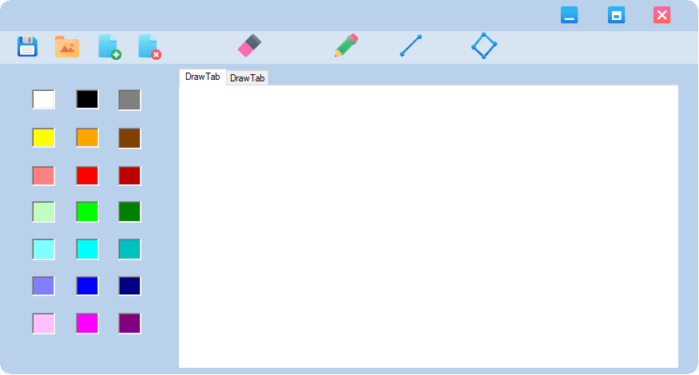

# SHAPES DRAWER
Desktop application for drawing geometric figures (line, rectangle and free drawing mode) with drawing preview, color selection, tabs, saving and loading the drawing from a file. Created with Windows Forms interface (.NET Framework).  

## Table of contents
* [General info](#general-info)
* [Technologies](#technologies)
* [Setup](#setup)
* [Features](#features)
* [Graphical User Interface](#graphical-user-interface)
* [Project status](#project-status)
* [Other information](#other-information)

## General info 
The program allows to draw basic geometric shapes (a straight line from point to point, a rectangle between two points, points - free drawing mode). Drawn objects are visible during the drawing. You can choose a color (from several predefined) and the type of shape currently drawn.
For individual shapes, there are definied classes describing their behavior e.g. on mouse cursor movement, pressing, releasing the mouse button (using polymorphism in form.cs).
The interface for drawing is in the form of tabs with subsequent drawings. You can close, move, maximize and minimize the window. The content of the tabs can be saved to and loaded from a file. Tabs can be closed and new ones opened. After closing the last tab, the program exits.

## Technologies
Project is created with: 
* C# v6.0
* .NET framework  v4.6.1

## Setup 
### Prerequisites and getting the tools
Visual Studio 2017 Version 15.6.6 or later from https://visualstudio.microsoft.com/vs/preview, selecting the .NET desktop development workload with the options: .NET Framework 4.6.1 development tools.

### Get executable file
1. Create a C# Windows Forms Application
2. Rebuild / Run project 
3. Copy your executable (found in that bin directory) to the target machine. There may also be a couple of other required / useful files in that folder that you might also want to copy (such as a .exe.config or .pdb file). 

## Features
* Drawing on the Panel class object.
* MouseDown, MouseUp, MouseMove events support.
* Proper drawing in the Paint event handler.
* Drawing preview (after pressing the mouse button, the program draws a rectangle from the place of pressing to the current location of the mouse cursor).
* Double buffering (to avoid panel flickering when drawing).
* The contents of the tab with the drawing can be saved to / loaded from a file.
* The window can be closed, moved, maximized and minimized.

## Graphical User Interface

## Project status 
In development. 

## Other information
* Author: Mariola Wójcik
* E-Mail: mwojcik95@gmail.com 
* License: Apache License 2.0
